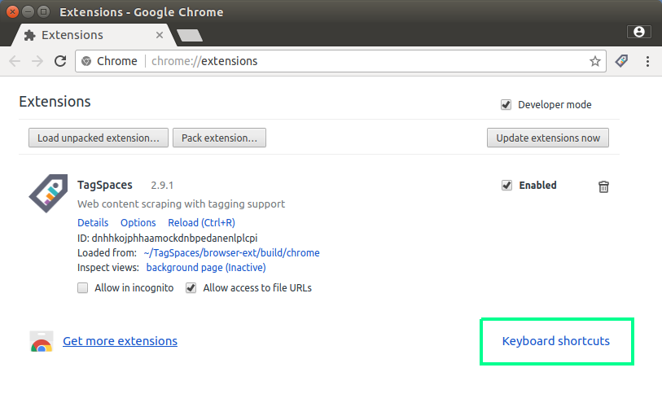
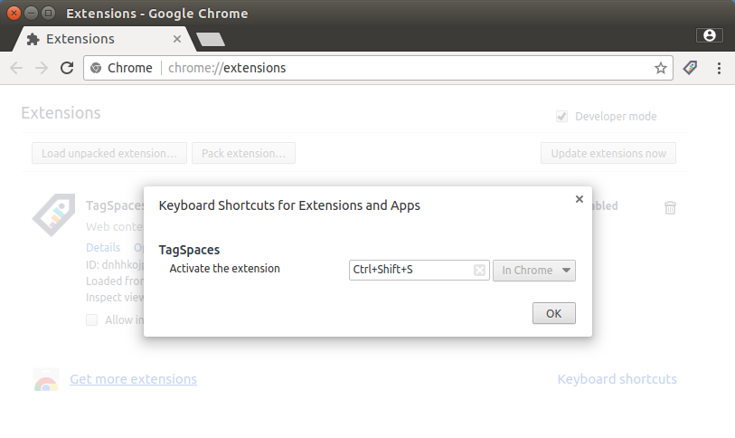

# TagSpaces web clipper for Chrome & Firefox

## Download

* Google Chrome: [Chrome Web Store - TagSpaces](https://chrome.google.com/webstore/detail/tagspaces/ldalmgifdlgpiiadeccbcjojljeanhjk)
* Firefox: [TagSpaces :: Add-ons for Firefox](https://addons.mozilla.org/en-US/firefox/addon/tagspaces/)

## Features


## Keyboard Shortcuts (Chrome-only)

You can add keyboard shortuts for opening the web scrapping menu.

1. Open Extensions Page at chrome://extensions/.
2. Scroll to the bottom and click "Keyboard shortcuts"

3. Assign Keyboard Shortcuts in the dialog.



## Known Issues

## Development

### Install dependencies

```
yarn install
```

### Build for Development

```
yarn build
```

* Chrome Version: `build/chrome/`
* Firefox Version: `build/firefox/`

To debug in Chrome: [Window] Menu -> Extensions -> Load unpacked extension

To debug in Firefox: [Tools] Menu -> Add-ons -> [Gear] Icon -> Debug Add-ons -> Load Temporary Add-on

## License

See [LICENSE](./LICENSE)
